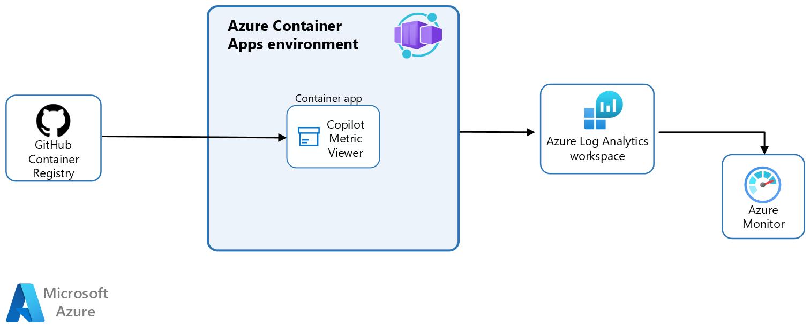

# Deployment of Copilot Metrics Viewer

There are a few ways to deploy the Copilot Metrics Viewer, depending on the type of metrics (Organization/Enterprise) and the level of control required.

The app runs in a Docker container, so it can be deployed anywhere containers are hosted (AWS, GCP, Azure, Kubernetes, etc.).

## Authentication to GitHub

The Metrics Viewer can be integrated with GitHub application authentication, which authenticates the user and verifies their permissions to view the metrics. This option is recommended since it doesn't use Personal Access Tokens. The downside of using a GitHub application is that it can only authorize users to view metrics at the organization level (no support for Enterprise).

With a Personal Access Token, user credentials are not verified, and the application simply renders Copilot metrics fetched using the PAT stored in the backend.

## Authentication for Copilot Metrics Viewer

By default Azure Deployments deploy a web app available on the public Internet without authentication (unless GitHub app is used).

Application can be easily secured in azure using built-in features like Authentication settings on ACA/AppService (EasyAuth on Azure). Azure Container Apps and App Services allow for adding IP restrictions on ingress. Both can also be deployed using private networking architectures. 

Options below provide most basic and cost effective ways of hosting copilot-metrics-viewer.

## Scenario 1: One-click Azure Deployment

The simplest way to deploy is to use the "one-click" option that creates resources in Azure. The deployment includes:

* Azure Container App with a consumption environment
* Azure Log Analytics Workspace



Application will use a pre-built docker image hosted in GitHub registry: `ghcr.io/karpikpl/copilot-metrics-viewer-with-proxy`.

**Prerequisites:** Contributor permission to a resource group in Azure and a subscription with the `Microsoft.App` resource provider enabled.

**Estimated cost** for running this in Azure is about $1 per month, as Container Apps have the first 2 million requests each month free.

1. **Option 1 - Using a Personal Access Token in the Backend**:

    [](https://portal.azure.com/#create/Microsoft.Template/uri/https%3A%2F%2Fraw.githubusercontent.com%2Fkarpikpl%2Fcopilot-metrics-viewer%2Fmain%2Fazure-deploy%2Fwith-token%2Fazuredeploy.json)

2. **Option 2 - Using GitHub App Registration and GitHub Authentication**:

    When using this method, [register your app in Github first](#github-app-registration).

    [](https://portal.azure.com/#create/Microsoft.Template/uri/https%3A%2F%2Fraw.githubusercontent.com%2Fkarpikpl%2Fcopilot-metrics-viewer%2Fmain%2Fazure-deploy%2Fwith-app-registration%2Fazuredeploy.json)

    **Important**: After deploying Option 2, the redirect URI needs to be updated with the URL of the deployed container app.

    Go to: `https://github.com/organizations/<your-org>/settings/apps/<your-app>` or in the UI to the settings of the registered application and add the following redirect URLs:

    ```
    http://<YOUR Container APP URL>.azurecontainerapps.io/callback
    https://<YOUR Container APP URL>.azurecontainerapps.io/callback
    ```

## Scenario 2: Azure Deployment with azd

If more control over the deployed container image is needed, an infrastructure-as-code option has been provided using Azure Bicep. The application can be deployed using the [Azure Developer CLI](https://aka.ms/azd) (azd).

In this scenario, the container is built from the source code locally, which provides additional opportunities to modify, scan, etc.

**Prerequisites:** 
- Contributor permission to a subscription in Azure with the `Microsoft.App` resource provider enabled.
- Permissions for creating role assignments.
- Azure CLI (az), Azure Developer CLI  (azd) and Docker installed locally.

**Estimated cost** for running this in Azure is about $10 per month, Container Apps have the first 2 million requests each month free and Container Registry costs about $5.

The deployment creates:

* Azure Resource Group
* Azure Container App with a consumption environment
* Azure Container Registry
* Azure Log Analytics Workspace
* Azure Application Insights
* Azure Key Vault


Before running `azd up`, configure GitHub variables:

```bash
azd env set VUE_APP_SCOPE <organization/enterprise>
# when using organization
azd env set VUE_APP_GITHUB_ORG <org name>
# when using enterprise
azd env set VUE_APP_GITHUB_ENT <ent name>
azd env set VUE_APP_GITHUB_API /api/github
azd env set GITHUB_CLIENT_ID <client id>
azd env set GITHUB_CLIENT_SECRET <client secret for the GH App>
```

## Scenario 3: Deploying the container

Application can be deployed anywhere where containers can run and configured via environment variables:

For GitHub App:

```bash
docker run -it --rm -p 3000:3000 \
-e VUE_APP_SCOPE=organization \
-e VUE_APP_GITHUB_API=/api/github  \
-e VUE_APP_GITHUB_ORG=<org name> \
-e GITHUB_CLIENT_ID=<client id> \
-e GITHUB_CLIENT_SECRET=<client secret for the GH App> \
-e SESSION_SECRET=<random string>  \
ghcr.io/karpikpl/copilot-metrics-viewer-with-proxy
```

or with PAT token and enterprise:

```bash
docker run -it --rm -p 3000:3000 \
-e VUE_APP_SCOPE=enterprise \
-e VUE_APP_GITHUB_API=/api/github  \
-e VUE_APP_GITHUB_ENT=<enterprise name> \
-e VUE_APP_GITHUB_TOKEN=<github PAT> \
-e SESSION_SECRET=<random string>  \
ghcr.io/karpikpl/copilot-metrics-viewer-with-proxy
```

or with PAT token and organization:

```bash
docker run -it --rm -p 3000:3000 \
-e VUE_APP_SCOPE=organization \
-e VUE_APP_GITHUB_API=/api/github  \
-e VUE_APP_GITHUB_ORG=<org name> \
-e VUE_APP_GITHUB_TOKEN=<github PAT> \
-e SESSION_SECRET=<random string>   \
ghcr.io/karpikpl/copilot-metrics-viewer-with-proxy
```

## Github App Registration

While it is possible to run the API Proxy without GitHub app registration and with a hardcoded token, it is not the recommended way.

To register a new GitHub App, follow these steps:
1. Go to your organization's settings.
2. Navigate to "Developer settings".
3. Select "GitHub Apps".
4. Click "New GitHub App".

Replace `<your org>` with your organization name in the link:
`https://github.com/organizations/<your org>/settings/apps`

1. Set a unique name.
2. Provide a home page URL: your company URL or just `http://localhost`.
3. Add a callback URL for `http://localhost:3000`. (We'll add the real redirect URL after the application is deployed.)
4. Uncheck the "Webhook -> Active" checkbox.
5. Set the scopes:
   - Select **Organization permissions**.
   - Under **GitHub Copilot Business**, select **Access: Read-only**.
6. Create a client secret.
7. Install the app in the organization:
   - Go to "Install App".
   - Select your organization.

Note the `Client ID` and `Private Key`.